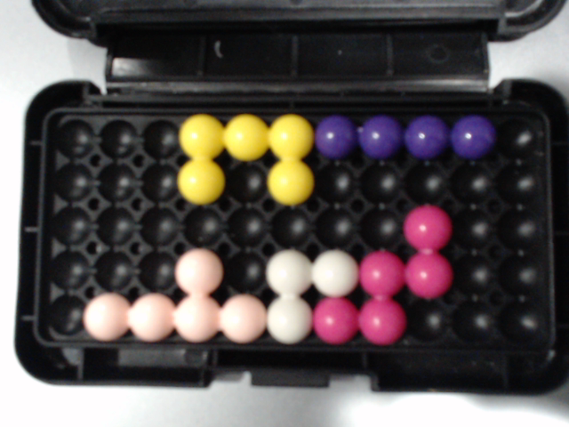
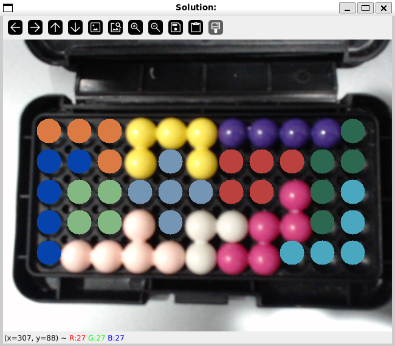
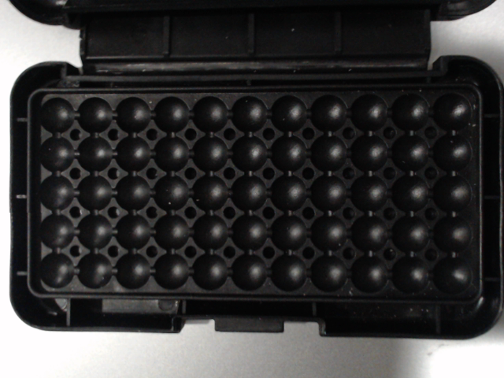
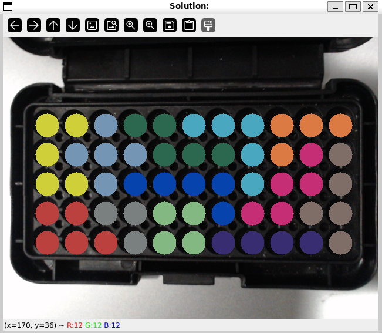
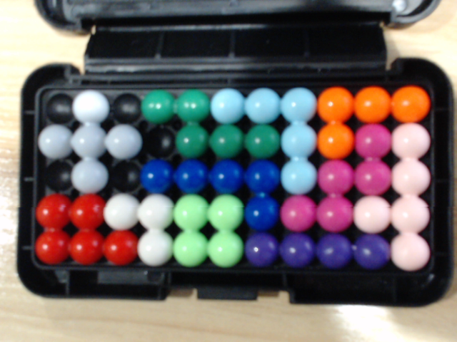
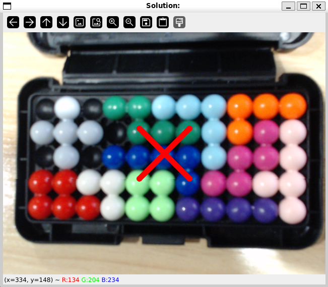

# Kanoodle Solver

## What is it
A program to automatically solve board configurations for the game Kanoodle using a webcam.

## How it works
Kanoodle is a board game where you place up to 12 puzzle pieces on a 5 x 11 grid. Below would be an example configuration.

### Example Configuration # 1 (Partially filled board)
*Configuration*



Using OpenCV, the colors are extracted from each ball and a string representation of the board is built. The above picture would be equivalent to the following string.
```
---IIIJJJJ-
---I-I-----
--------H--
---D-FFHH--
-DDDDFHH---
```
where `I` = yellow, `J` = purple, `D` = light pink, `F` = white, and `H` = dark pink.

The board string is then passed to a dancing links backtracking algorithm to find the first possible solution. Below is one solution for this example.

*Solution*



### Example Configuration # 2 (Empty board)
*Configuration*



*Solution*



### Example Configuration # 3 (No solution)
*Configuration*



*Solution*


